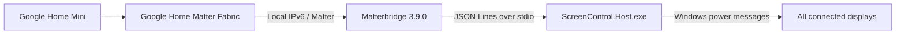

# Google Home Screen Control

使用 Google Home Mini 透過本機 Matter 控制 Windows 11 電腦的所有螢幕：

- `OK Google, turn off Computer Screen`
- `OK Google, turn on Computer Screen`

關閉螢幕時，Windows、網路及背景程式持續運作，不會睡眠、鎖定或登出。滑鼠與鍵盤仍可喚醒螢幕。

## 運作範圍

- 將全部螢幕視為一個名為 `Computer Screen` 的 Matter 開關。
- 使用 Windows 顯示電源訊息，不依賴 DDC/CI，因此兩台 Dell 螢幕會一起控制。
- Matterbridge 與 Windows 主機都在本機執行。
- 不需要 VPS、Home Assistant、Google Cloud-to-cloud 或公開連入連接埠。
- Google Home Mini 是 Matter Hub。Google 官方將 Google Home Mini 列為支援 Matter over Wi-Fi 的 Hub：
  - [Prepare your smart home for Matter](https://support.google.com/googlenest/answer/12391458?hl=en)
  - [Google Home supported Matter devices and hubs](https://developers.home.google.com/matter/supported-devices)

Matter 首次加入 Google Fabric 時需要 Google Home App 完成安全配對。配對完成後，日常語音控制由 Home Mini 經區域網路直接完成，不需要持續使用 App。

## 必要條件

- Windows 11
- Node.js 24.x
- .NET 8 Desktop Runtime 或 SDK
- `Ethernet` 網路介面已連線
- Google Home Mini 與電腦位於同一個可傳遞 multicast/mDNS 的區域網路
- 執行安裝時具有 Windows 系統管理員權限

安裝程式會將 `Ethernet` 的 IPv6 綁定啟用，並將網路類別改成 `Private`。Matter 需要區域 IPv6；原始設定會記錄供解除安裝時復原。

## 安裝

在「以系統管理員身分執行」的 PowerShell 中執行：

```powershell
Set-Location 'C:\Users\Alone\Desktop\Blank\google-home-screen-control'
powershell.exe -NoProfile -ExecutionPolicy Bypass -File .\Install.ps1 `
    -InterfaceAlias 'Ethernet' `
    -Confirm:$false
```

安裝程式會：

1. 驗證 Windows、Node.js、.NET 與網路介面。
2. 保存目前 IPv6 與網路類別。
3. 啟用 IPv6 並將網路設為 `Private`。
4. 建立只限 `Private`/`LocalSubnet` 的 UDP 5353 與 5540 防火牆規則。
5. 測試並發布 Windows 顯示控制主機。
6. 建置及安裝 Matterbridge 3.9.0 與本專案外掛。
7. 安裝會等待 `Ethernet` 與 IPv6 就緒的本機啟動器。
8. 建立目前使用者登入後自動啟動的排程工作。
9. 將螢幕關閉五秒再恢復，確認實際顯示控制可用。

重複執行安裝時，腳本會先停止既有 Matterbridge 程序，再替換全域套件並重新啟動排程；第一次保存的網路設定不會被後續執行覆寫。若要更換網路介面，必須先解除安裝並復原原介面。

只檢查而不修改系統：

```powershell
powershell.exe -NoProfile -ExecutionPolicy Bypass -File .\Install.ps1 `
    -ValidateOnly `
    -InterfaceAlias 'Ethernet'
```

如需跳過五秒螢幕測試，加入 `-SkipSelfTest`。

## 首次 Matter 配對

1. 確認排程工作 `Google Home Screen Control` 正在執行。
2. 在此電腦開啟 [http://127.0.0.1:8283/](http://127.0.0.1:8283/)。
3. Matterbridge 首頁會顯示 Matter QR code 與配對碼。
4. 在 Google Home App 選擇新增 Matter 裝置並掃描 QR code。
5. 將裝置加入 Home Mini 所在的同一個 Home，名稱保持為 `Computer Screen`。

這是一次性安全配對。重新登入或重新開機不需要再次配對；解除安裝預設也會保留 Matter 配對資料。

## 語音控制

配對後使用：

```text
OK Google, turn off Computer Screen
OK Google, turn on Computer Screen
```

若要使用完全相同的自訂句子：

```text
OK Google, turn off this computer screen
OK Google, turn on screen
```

可在 Google Home 建立兩個 Household Automation，分別把上述句子對應到 `Computer Screen` 的 Off 與 On。這只影響語句解析，不改變本機控制路徑。

## 系統行為

### 關閉

Windows 主機廣播 `SC_MONITORPOWER = 2`，讓所有螢幕停止顯示訊號。電腦保持喚醒，Matterbridge 與網路繼續運作。

### 開啟

Windows 主機廣播 `SC_MONITORPOWER = -1` 並送出暫時的 display-required 訊號。若兩秒後 Windows 仍回報螢幕關閉，才使用一次一像素滑鼠移動再移回原位作為後備喚醒。

### 手動喚醒

滑鼠或鍵盤可正常喚醒螢幕。Windows 的實際顯示狀態會回寫到 Matter `OnOff` 屬性。

### 登入工作階段

顯示控制需要互動式 Windows 工作階段。排程工作在目前使用者登入後啟動；登出後無法控制該桌面的螢幕。

登入或從 Windows 電源狀態恢復時，`Start-Matterbridge.ps1` 先等待 `Ethernet` 為 Up、IPv6 已啟用且已有 Preferred IPv6 位址。它只清除可安全重建的 Matter session resumption 與 subscription cache，Google Home fabric、裝置配對及存取控制資料都會保留。Node 與 Windows Host 會被放入 `JOB_OBJECT_LIMIT_KILL_ON_JOB_CLOSE` Windows Job Object，確保排程停止或異常終止時不留下孤立程序。

## 架構



- `plugin/`：Matterbridge DynamicPlatform，公開 On/Off Plug-In Unit。
- `src/ScreenControl.Host/`：Windows 顯示控制、喚醒鎖與狀態監聽。
- `Start-Matterbridge.ps1`：等待網路就緒、移除重啟敏感 session cache 並啟動 Matterbridge。
- `Install.ps1`：可重跑的建置、網路、防火牆及排程安裝。
- `Uninstall.ps1`：解除安裝並復原已保存的網路設定。
- `Test-All.ps1`：完整自動驗證入口。

Matterbridge 外掛只有在 Windows 主機成功回覆後才更新 Matter 狀態。主機意外中止時，監督器會重建程序並只重試命令一次，避免無限重送。

## 驗證

執行完整測試：

```powershell
powershell.exe -NoProfile -ExecutionPolicy Bypass -File .\Test-All.ps1
```

驗證內容包括：

- 28 個 .NET 單元與程序整合測試。
- 16 個 TypeScript 單元與子程序整合測試。
- TypeScript strict typecheck 與正式建置。
- npm 發布套件內容乾跑。
- 5 個 PowerShell 安裝、啟動器、Job Object 及解除安裝驗證測試。
- 所有 PowerShell 檔案語法解析。

## 診斷

查看排程狀態：

```powershell
Get-ScheduledTask -TaskName 'Google Home Screen Control' |
    Select-Object TaskName, State
```

重新啟動背景服務：

```powershell
Stop-ScheduledTask -TaskName 'Google Home Screen Control' -ErrorAction SilentlyContinue
Start-ScheduledTask -TaskName 'Google Home Screen Control'
```

查看 Matterbridge 外掛與日誌：

```powershell
matterbridge.cmd --list
Get-Content "$HOME\.matterbridge\matterbridge.log" -Tail 100
Get-Content "$env:LOCALAPPDATA\GoogleHomeScreenControl\launcher.log" -Tail 100
```

檢查 Matter 所需的網路狀態：

```powershell
Get-NetAdapterBinding -Name 'Ethernet' -ComponentID ms_tcpip6
Get-NetConnectionProfile -InterfaceAlias 'Ethernet'
Get-NetIPAddress -InterfaceAlias 'Ethernet' -AddressFamily IPv6
```

手動執行五秒顯示測試：

```powershell
$hostPath = Join-Path (npm.cmd root --global) `
    'matterbridge-google-home-screen-control\bin\ScreenControl.Host.exe'
& $hostPath --self-test
```

## 解除安裝

預設移除服務、外掛與防火牆規則，復原安裝前的 IPv6/網路類別，並保留 Matter 配對資料：

```powershell
powershell.exe -NoProfile -ExecutionPolicy Bypass -File .\Uninstall.ps1 `
    -Confirm:$false
```

只查看解除安裝計畫：

```powershell
.\Uninstall.ps1 -ValidateOnly
```

不復原網路設定：

```powershell
.\Uninstall.ps1 -RestoreNetwork:$false -Confirm:$false
```

同時刪除 Matterbridge 的全部本機配對資料：

```powershell
.\Uninstall.ps1 -PurgeMatterData -Confirm:$false
```

`-PurgeMatterData` 會影響同一個 Windows 使用者下的其他 Matterbridge 配對，除非確定不再使用，否則不要指定。

## 安全性

- 管理前端只綁定 `127.0.0.1:8283`，區域網路其他裝置不能直接開啟。
- 防火牆只允許 Node.js 在 `Private` 網路接受 `LocalSubnet` 的 UDP 5353/5540。
- 不建立公網入口，不保存 Google 密碼或 OAuth token。
- Matter 配對金鑰由 Matterbridge 儲存在目前使用者的 `$HOME\.matterbridge` 與 `$HOME\.mattercert`。

## What Was Wrong

- Google Home Mini 不能直接呼叫 Windows 命令或任意本機 HTTP endpoint。
- 單純關閉螢幕可能讓 Windows 之後睡眠，導致無法從網路重新喚醒顯示。
- 沒有保存網路原始狀態的安裝流程會使解除安裝無法可靠復原。
- Windows 恢復時載入舊 Matter session cache，可能先嘗試不可達的舊 IPv6 peer，造成 Google Home 暫時離線。

## Why It Was Bad

- 雲端 webhook 或 VPS 會增加公開攻擊面、帳戶整合與持續維運成本。
- 將畫面狀態視為命令結果而不監聽 Windows，會在滑鼠喚醒後回報錯誤狀態。
- 缺少重試上限與命令序列化可能造成程序重啟迴圈或顯示狀態競爭。

## What To Avoid Next Time

- 不要用關閉輸出訊號取代睡眠，或反過來把睡眠當成關閉螢幕。
- 不要將 Matter 管理前端暴露到 LAN 或 Internet。
- 不要刪除 `$HOME\.matterbridge`，除非確定要移除全部 Matter 配對。
- 不要刪除 Matter fabric 或 operational credential；重啟恢復只需移除 session/subscription cache。
- 不要繞過完整測試直接發布主機或外掛套件。

## Correct Approach

- 使用 Home Mini 支援的區域 Matter Fabric，將 Windows 顯示抽象成一個標準 On/Off 裝置。
- 讓 Matterbridge 負責 Matter 協定，專用 .NET 主機負責互動式 Windows API。
- 持續保持系統喚醒，只切換顯示電源訊號，並監聽實際顯示狀態。
- 在啟動 Matterbridge 前等待 IPv6 就緒，並重建可安全丟棄的 session/subscription 狀態。
- 將網路、防火牆、排程與原始設定復原納入同一套可驗證安裝流程。

## Background Startup Audit

### What Was Wrong

- The interactive logon task launched a console-subsystem process directly.
- Matterbridge therefore opened a persistent console window after every sign-in.
- A temporary VBS wrapper hid the window but detached the service child tree from Task Scheduler stop control.

### Why It Was Bad

- A long-running background integration should not require a visible terminal.
- Switching the task to a non-interactive session would hide the window but break ownership of interactive display control.
- A launcher that outlives Task Scheduler ownership prevents reliable restart, update, and failure recovery.

### What To Avoid Next Time

- Do not register `node.exe`, `cmd.exe`, or another console executable directly as an interactive long-running task action.
- Do not use `WScript.Shell.Run` to detach the service process from Task Scheduler, because failure detection and restart behavior become inaccurate.

### Correct Approach

- Run `powershell.exe -WindowStyle Hidden` directly as the interactive Task Scheduler action.
- Assign Node to a `JOB_OBJECT_LIMIT_KILL_ON_JOB_CLOSE` job and keep PowerShell waiting for its exit code, so stopping the task terminates the entire process tree.
- Remove only restart-sensitive Matter session caches; preserve fabric and commissioning records.

## License

MIT
